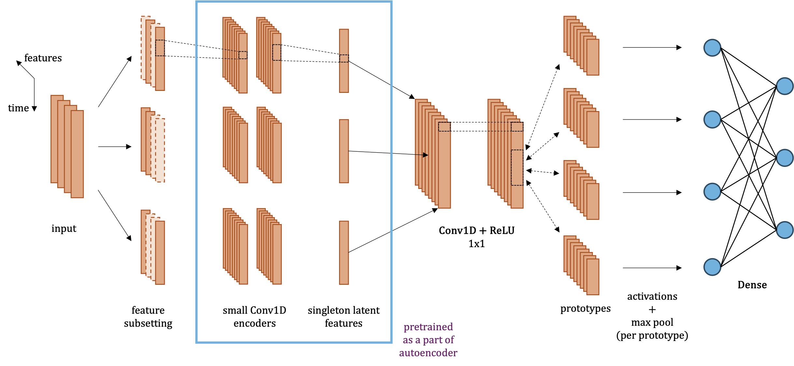

# ProtoTSNet: Interpretable Multivariate Time Series Classification With Prototypical Parts

This repository accompanies our paper describing ProtoTSNet titled *ProtoTSNet: Interpretable Multivariate Time Series Classification With Prototypical Parts*.

It contains an implementation of ProtoTSNet, a new architecture for multivariate time series classification based on the prototypical parts approach of ProtoPNet. Some code fragments are adapted from the [ProtoPNet implementation](https://github.com/cfchen-duke/ProtoPNet).

Architecture of the model:



## Prerequisites

The experiments were conducted using:
- Python 3.11
- PyTorch 2.2.0
- CUDA toolkit 11.8

To get started:
1. Clone the repository.
2. Create a virtual environment with Python 3.11 (preferably - it will likely work on other versions, but this one is tested).
2. Install the requirements:

```sh
# Option 1: CUDA 11.8
pip install -r requirements.txt --extra-index-url https://download.pytorch.org/whl/cu118

# Option 2: Latest CUDA version for the PyTorch version we use (if Option 1 causes issues)
pip install -r requirements.txt
```

## Datasets

The experiments were conducted on two types of datasets:

- [UEA Archive Datasets](https://www.timeseriesclassification.com). Example dataset (Libras) is included in the repository. Datasets must be in the arff format, each has to be placed in its own directory, with `[DatasetName]_TRAIN.ts` and `[DatasetName]_TEST.ts` files. To download the rest of UEA datasets:
```sh
cd datasets
wget http://www.timeseriesclassification.com/aeon-toolkit/Archives/Multivariate2018_arff.zip
unzip Multivariate2018_arff.zip
mv Multivariate_arff/* .
```
- Artificial Dataset. Implementation provided in `artificial_protos_datasets.py`, used in the artificial dataset experiments described in the paper.

The code also supports a custom dataset, but an appropriate loading function has to be added in the code. See example of such function in `main.py` as a template. Implement your own loading function following the same interface.

## Usage

The main entry point for training the model is `main.py`, which provides various configuration options through command-line arguments.

### Example usages

Run experiment on UEA dataset:
```bash
python main.py --uea_dataset Libras --experiment_name my_experiment
```

Run experiment on artificial dataset:
```
python main.py --artificial_dataset --experiment_name artificial_dataset_exp --proto_len 0.2 --reception 0.75
```

Run hyperparameter optimization on a custom dataset (after implementing the load function):
```
python main.py --experiment_name custom_dataset_exp --param_selection
```

### Provided Scripts

The repository includes several bash scripts that were used in the experiments and ablation studies described in the paper:

```bash
run_hyperparam_selection.sh

run_full.sh
run_reg.sh
run_no_pretraining.sh
run_reg_pretraining.sh
```

These scripts automate running experiments on all of the UEA datasets. The scripts can be run as is, without any parameters, for example:
```bash
./run_reg.sh  # runs ProtoTSNet variant with regular encoder and no pretraining
```

### Key Parameters

Selected parameters are listed below, run `python main.py --help` to check all of them.

- `--experiment_name <name>`: Set experiment name (directory with such name will be created under `experiments/` directory in the repo, see [experiment output section](#experiment-output) for more details)
- `--proto_len <float>`: Prototype length (0-1 range, fraction of series length)
- `--reception <float>`: Fraction of significant features (0-1 range)
- `--protos_per_class <num>`: Number of prototypes for each class (default: 10)
- `--param_selection`: Run hyperparameter selection using grid search:
    - Reception values: `[0.25, 0.5, 0.75, 0.9]`
    - Prototypes lengths: `[0.01, 0.1, 0.2, 0.5, 1]`

For UEA datasets, optimal hyperparameters are provided in `best_params.csv`. For other datasets, `proto_len` and `reception` must be specified manually (or parameter selection has to be run).

### Additional Options

- `--verbose`: Enable verbose output - statistics are written to stdout after every epoch, they can always be found in `log.txt` file in the experiment directory

#### Dataset options
- `--uea_dataset <dataset_name>`: Run experiment on `<dataset_name>` coming from UEA
- `--artificial_dataset`: Use artificial dataset
- `--skip_scaling`: Skip scaling of the dataset (all datasets are scaled by default)
- For custom datasets, no parameter is required (the dataset is loaded by default if no dataset parameter is provided)

#### Architecture options

- `--no_permuting_encoder`: Disable permuting encoder
- `--no_encoder_pretraining`: Skip encoder pretraining
- `--proto_features <num>`: Number of latent features (default: 32)

#### Training parameters

- `--pretraining_epochs <num>`: Number of encoder pretraining epochs (default: 50)
- `--epochs <num>`: Number of epochs to train (default: 200)
- `--num_warm_epochs <num>`: Number of warm epochs (where only prototype layer and the 1x1 convolution layer before it are trained, default: 50)
- `--push_start_epoch <num>`: When to start pushing prototypes (prototypes are pushed every 30 epochs, it can be changed directly in `main.py`, default: 110)
- `--last_layer_epochs <num>`: Number of epochs to train last layer (default: 40)

> [!IMPORTANT]
> The epoch counting approach handles different training phases differently:
> 1. *Pretraining phase* (`--pretraining_epochs`):
>    Initial encoder pretraining, separate from the main training.
> 2. *Main training phase* (`--epochs`):
>    - Includes WARM epochs (frozen encoder) and JOINT epochs (all layers trained).
>    - Every 30 epochs after `--push_start_epoch`, a PUSH operation occurs.
>    - Each PUSH is followed by `--last_layer_epochs` of last layer training.
>    - Both PUSH and last layer training count as a single epoch in the main phase.
>
> This counting method follows the ProtoPNet approach, though it might seem counter-intuitive at first.

### Experiment Output

When you run an experiment, a directory `experiments/<experiment_name>` is created containing:
- `*.py` files: Copy of the current state of the code
- `models` subdirectory: Trained models saved after the last epoch
- `protos` subdirectory: Prototypes along with prototypical parts from the last push epoch of the training
- `stats.json`: Statistics from each epoch of training
- `log.txt`: Training logs
- `results.json`, `confusion_matrix.txt`: Accuracy, training time, and confusion matrix (written in the numpy text format)

## Project Structure

The codebase consists of the following files:

- `autoencoder.py`: Implementations of the encoder architectures (both permuting and regular), autoencoder, and pretraining utilities.
- `model.py`: Implementation of the ProtoTSNet architecture.
- `push.py`: Implementation of the prototype push phase, where prototypes are pushed onto actual sub-sequences from the training set.
- `train.py`: Training infrastructure, including:
 - `ProtoTSNetTrainer` class managing the training process,
 - statistics gathering and logging,
 - training phases coordination.
- `datasets_utils.py`: Dataset handling utilities for loading and preprocessing time series data.
- `receptive_field.py`: Utilities for handling prototypes' receptive fields in the input space.
- `artificial_protos_datasets.py`: Implementation of the artificial dataset used in experiments described in the paper.

Additional utilities:
- `results_gather.py`: Standalone script for processing and displaying results of UEA hyperparameter optimization.
